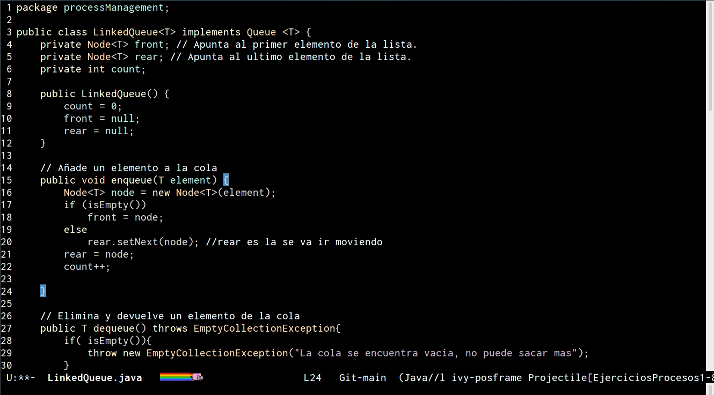

# Liskov theme
Es un tema para emacs, el nombre es honor a la ciencifica de la computacion [Barbara Liskov](https://en.wikipedia.org/wiki/Barbara_Liskov).

Junto a la también especialista en ciencias de la computación [Jeannette Wing](https://en.wikipedia.org/wiki/Jeannette_Wing), desarrolló el denominado **principio de sustitución de Liskov**, un principio de la programación orientada a objetos.

Entre otros muchos reconocimientos, en 2008 ganó el premio Turing por su contribución a los fundamentos teóricos y prácticos en el diseño de lenguajes de programación y sistemas, especialmente relacionados con la abstracción de datos, tolerancia a fallos y computación distribuida.

## Settings
Clonar el repositorio en tu carpeta de themes y agregar en tu init.el

~~~
(add-to-list 'custom-theme-load-path "~/.emacs.d/initFileEmacs/myThemes/Liskov-theme")
(load-theme 'liskov t)
~~~

### References
<https://en.wikipedia.org/wiki/Liskov_substitution_principle>
<https://es.wikipedia.org/wiki/Principio_de_sustituci%C3%B3n_de_Liskov>

